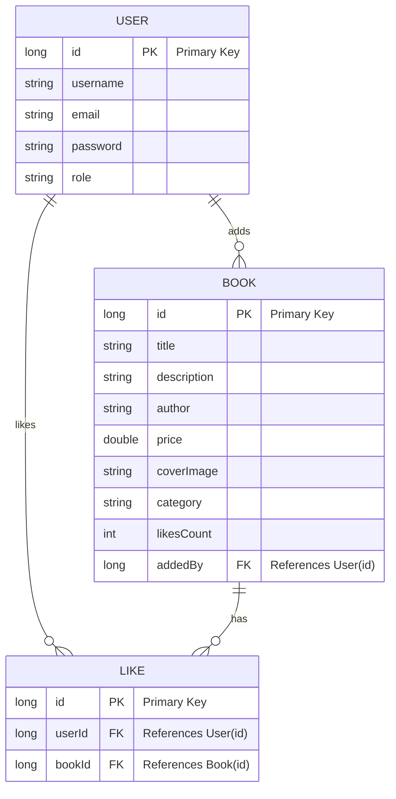

## 📚 BookHub  (Spring Boot Online Bookstore)

A robust and fully documented RESTful API designed for managing a digital book library. It features a role-based access control system (USER and ADMIN) and provides advanced interactive features like liking, searching, and filtering books.
---
---
## 🚀 Features

### User Features
- Register and login with email & password  
- Fetch user profile by ID or email  
- Role-based distinction (USER / ADMIN)

### Book Features
- Add, update, delete books (Admins only)  
- Upload cover images for books  
- Search books by title or category  
- View top liked books globally or by category  
- Pagination support for all book listings  

### Like System
- Users can like/unlike books  
- Prevent duplicate likes  
- Real-time likes count update  

### Admin Features
- Admin-only CRUD for books  
- View all books added by a specific admin  

---

## 📌 Technologies Used

| Technology | Purpose |
|------------|---------|
| **Java 17** | Core backend language |
| **Spring Boot** | REST controllers, routing, and backend logic |
| **Hibernate / JPA** | ORM and entity mapping |
| **MySQL** | Relational database for users, books, and likes |
| **Swagger** | API documentation and testing |
| **Lombok** | Reduce boilerplate (getters, setters, constructors) |
| **Maven** | Dependency and build management |
| **Tomcat** | Embedded server |
| **HTML / CSS / JS** | Frontend UI for users |

---

## 📑 API Endpoints

### User APIs
| Method | Endpoint                  | Description                       |
|--------|---------------------------|-----------------------------------|
| POST   | /userApi/v1/registration  | Register a new user               |
| POST   | /userApi/v1/login         | Login with email and password     |
| GET    | /userApi/v1/user          | Get user by ID                    |
| GET    | /userApi/v1/user/email    | Get user by email                 |

### Book APIs
| Method | Endpoint                         | Description                                      |
|--------|----------------------------------|-------------------------------------------------|
| GET    | /bookApi/v1/books                | Get all books (paginated)                       |
| GET    | /bookApi/v1/book/{id}            | Get book by ID                                  |
| GET    | /bookApi/v1/books/search/title   | Search books by title                            |
| GET    | /bookApi/v1/books/search/category| Search books by category                        |
| GET    | /bookApi/v1/books/top-liked      | Top liked books (all categories)               |
| GET    | /bookApi/v1/books/top-liked/category | Top liked books by category                 |
| POST   | /bookApi/v1/book                 | Add a new book (Admin only)                     |
| PUT    | /bookApi/v1/book/{id}            | Update a book (Admin only)                      |
| DELETE | /bookApi/v1/book/{id}            | Delete a book (Admin only)                      |
| GET    | /bookApi/v1/books/admin/{adminID}| Get books added by a specific admin            |
| POST   | /bookApi/v1/books/like           | Like a book                                     |
| DELETE | /bookApi/v1/books/like           | Unlike a book                                  |

---
## Database Schema

---

## 📌 API Documentation
- [Swagger UI](http://localhost:8081/swagger-ui/index.html) *(Run the Spring Boot server locally to access)*

---

## 🔍 API Overview

### 1️⃣ Book APIs
Endpoints for managing books, including CRUD, search, and like/unlike features.

---

### 2️⃣ User APIs
Endpoints for user registration, login, and fetching user data.

---

### 3️⃣ Schemas
Data models and request/response schemas used in the API.

---

## Project Overview

## 1️⃣ Landing Page
Main landing page for the BookHub application.  

---

## 2️⃣ Login Page
User login page for authentication.  

---

## 3️⃣ Register Page
User registration page.  

---

## 4️⃣ Admin Dashboard
Overview of the admin dashboard showing statistics and management features.  

---

## 5️⃣ Add Book Form
Form used for adding new books in the system.  

---

## 6️⃣ Edit Book Form
Form used to edit existing book details.  

---

## 7️⃣ All Books
List of all books available in the system.  

---

## 8️⃣ Top Liked Books
Displays top liked books in the system.  

---

## 9️⃣ Profile Page
Displays user profile information and settings.  

---
